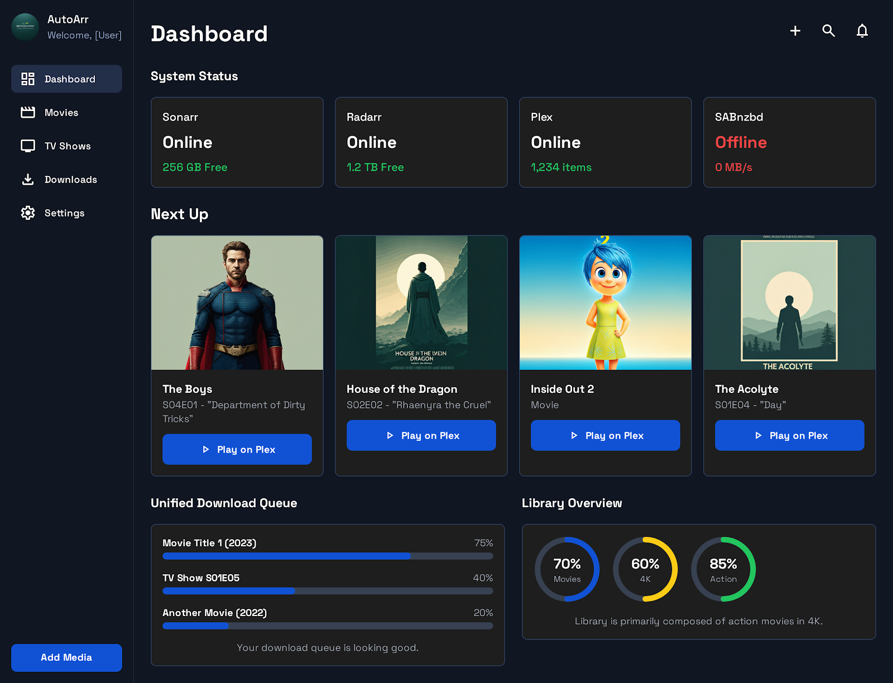

# AutoArr Monorepo

> **Intelligent cruise control for your \*arr media automation stack**

[](./LICENSE)
[](https://hub.docker.com/r/autoarr/autoarr)
[](https://github.com/autoarr/autoarr)

---

## 📦 Monorepo Structure

This repository contains two products:

### 🟢 **AutoArr** (GPL-3.0) - 100% Free & Open Source
**Location:** `/app/autoarr/`

- ✅ **100% Free Forever** - No limitations, no subscriptions
- ✅ **GPL-3.0 Licensed** - Open source like Sonarr and Radarr
- ✅ **Self-Hosted** - Complete privacy and control
- ✅ **Full Features** - Configuration auditing, download recovery, natural language requests
- ✅ **Docker Hub** - Easy deployment

**See:** [autoarr/README.md](./autoarr/README.md) | [Documentation](./docs/autoarr/)

### 🔵 **AutoArrX** (Proprietary) - Premium Cloud Intelligence
**Location:** `/app/autoarrx/`

- ⭐ **Cloud-Enhanced** - Advanced LLM, smart notifications, predictive analytics
- ⭐ **Privacy-First** - End-to-end encryption, no media file access
- ⭐ **Optional** - AutoArr works perfectly without it
- ⭐ **Azure SaaS** - Managed cloud service

**See:** [autoarrx/README.md](./autoarrx/README.md) | [Pricing](./docs/autoarrx/PRICING.md) | [Privacy](./docs/autoarrx/PRIVACY.md)

---


_Aspirational UI: Modern, unified dashboard for your entire media automation stack_

---

## 🎯 What is AutoArr?

AutoArr is an **intelligent orchestration layer** that sits above your media automation stack (SABnzbd, Sonarr, Radarr, and Plex), providing autonomous configuration optimization, intelligent download recovery, and natural language content requests.

Think of it as **cruise control for your media server** — it continuously monitors your setup, learns best practices, and keeps everything running optimally without manual intervention.

**100% Open Source** (GPL-3.0) - Just like Sonarr and Radarr. Self-hosted, privacy-first, no subscriptions required for full functionality.

> **Looking for premium features?** See [AutoArrX Pricing](docs/autoarrx/PRICING.md) for optional cloud enhancements like smart notifications, predictive analytics, and multi-instance management - all with privacy-first encryption.

### The Problem We Solve

Managing a \*arr media automation stack is **complex and time-consuming**:

- ⚙️ **Configuration Overhead**: Each app has dozens of settings that need constant tuning
- 🔄 **Failed Downloads**: Manual intervention required when downloads fail
- 🎬 **Multiple UIs**: Juggling between different interfaces to request and manage content
- 📚 **Evolving Best Practices**: Keeping up with community recommendations is exhausting
- 🔍 **Maintenance Burden**: Constant monitoring and troubleshooting required

### Our Solution

AutoArr provides three core capabilities:

#### 🧠 **Configuration Intelligence**

- Scans all connected applications and audits their settings
- Compares against latest community best practices
- Uses AI (Claude API or local LLM) to understand context and priorities
- Recommends optimizations with clear explanations
- One-click application with rollback safety

#### 🤖 **Autonomous Recovery**

- Monitors SABnzbd queue in real-time
- Detects failed downloads immediately
- Automatically triggers alternative searches intelligently
- Manages quality fallbacks and wanted lists
- Learns from patterns to prevent future failures

#### 💬 **Natural Language Interface**

- Request content in plain English: _"Add the new Dune movie in 4K"_
- Automatically classifies movies vs. TV shows
- Confirms matches before adding to your library
- Provides real-time status updates
- Tracks request history

---

## 🚀 Quick Start

### Prerequisites

- Docker & Docker Compose
- Running instances of: **SABnzbd**, **Sonarr**, **Radarr** (Plex optional)
- API keys for each application

### Installation (Coming Soon)

```bash
# 1. Clone the repository
git clone https://github.com/autoarr/autoarr.git
cd autoarr

# 2. Configure environment
cp .env.example .env
# Edit .env with your API keys

# 3. Start AutoArr
docker-compose up -d

# 4. Access the dashboard
open http://localhost:3000
```

For detailed setup instructions, see [**docs/QUICK-START.md**](docs/QUICK-START.md).

---

## 📚 Documentation

### **Getting Started**

Start here to understand AutoArr and get it running:

1. [**QUICK-START.md**](docs/QUICK-START.md) - Get up and running in 30 minutes
2. [**DOCKER_SETUP.md**](docs/DOCKER_SETUP.md) - Production deployment with Docker/Synology
3. [**PROJECT-SUMMARY.md**](docs/PROJECT-SUMMARY.md) - Executive overview and key decisions

### **Deployment**

For production deployment:

- [**DEPLOYMENT.md**](DEPLOYMENT.md) - Complete deployment guide
- [**DEPLOYMENT_PIPELINE.md**](docs/DEPLOYMENT_PIPELINE.md) - CI/CD and automated builds
- [**DOCKER_SETUP.md**](docs/DOCKER_SETUP.md) - Docker and Synology NAS setup

### **Understanding the Vision**

Learn about the product strategy and goals:

3. [**VISION_AND_PRICING.md**](docs/VISION_AND_PRICING.md) - Product vision, AutoArr vs AutoArrX, pricing
4. [**archive/NAME-ANALYSIS.md**](docs/archive/NAME-ANALYSIS.md) - Why we chose "AutoArr" (archived)

### **Technical Deep Dive**

For developers and those interested in how it works:

5. [**ARCHITECTURE.md**](docs/ARCHITECTURE.md) - Complete technical architecture
6. [**BUILD-PLAN.md**](docs/BUILD-PLAN.md) - 20-week development roadmap with TDD
7. [**CODE-EXAMPLES.md**](docs/CODE-EXAMPLES.md) - Starter code and implementation patterns

### **AI/LLM Strategy** (Advanced)

For those interested in the local LLM training approach:

8. [**LLM-TRAINING-STRATEGY.md**](docs/LLM-TRAINING-STRATEGY.md) - Complete local LLM strategy with LangChain
9. [**LLM-IMPLEMENTATION-GUIDE.md**](docs/LLM-IMPLEMENTATION-GUIDE.md) - Code and scripts for training

### **Contributing**

Want to help build AutoArr?

10. [**CONTRIBUTING.md**](docs/CONTRIBUTING.md) - Developer guidelines and workflow

---

## ✨ Key Features

### 🎛️ **Intelligent Configuration Auditing**

- Scans SABnzbd, Sonarr, Radarr, and Plex configurations
- Compares against curated best practices database
- Uses web search to find latest community recommendations
- AI-powered contextual analysis and prioritization
- Tracks configuration history for safe rollbacks

### 🔄 **Automatic Download Recovery**

- Real-time monitoring of SABnzbd queue
- Instant detection of failed downloads
- Intelligent retry strategies (quality fallback, alternative releases)
- Proactive wanted list management
- Detailed activity logging

### 💬 **Natural Language Content Requests**

- Chat-based interface for content requests
- Automatic movie vs. TV show classification
- Smart search with disambiguation
- Integration with Sonarr and Radarr
- Real-time download tracking

### 📊 **Unified Dashboard**

- At-a-glance health monitoring
- Configuration audit results
- Active downloads and queue status
- Recent activity feed
- Mobile-first responsive design

---

## 🏗️ Architecture Overview

AutoArr is built on a **microservices architecture** using the **Model Context Protocol (MCP)** for application integration:

```
┌─────────────────────────────────────────────────┐
│           React UI (Mobile-First)               │
└──────────────────┬──────────────────────────────┘
                   │
┌──────────────────▼──────────────────────────────┐
│          FastAPI Gateway                        │
│         (Authentication, Rate Limiting)         │
└──────────────────┬──────────────────────────────┘
                   │
┌──────────────────▼──────────────────────────────┐
│              Core Services                      │
│  • Configuration Manager                        │
│  • Monitoring Service                           │
│  • Request Handler                              │
│  • Intelligence Engine (LLM + RAG)              │
└──────────────────┬──────────────────────────────┘
                   │
┌──────────────────▼──────────────────────────────┐
│           MCP Orchestrator                      │
│     (Connection Pool, Error Handling)           │
└─────┬────────┬──────────┬──────────┬────────────┘
      │        │          │          │
┌─────▼───┐ ┌─▼────┐ ┌───▼────┐ ┌───▼────┐
│SABnzbd  │ │Sonarr│ │ Radarr │ │  Plex  │
│   MCP   │ │  MCP │ │   MCP  │ │  MCP   │
└─────────┘ └──────┘ └────────┘ └────────┘
```

**Key Design Principles:**

- **Non-invasive**: Uses official APIs through MCP abstraction
- **Intelligent**: LLM-powered reasoning, not just rules
- **Transparent**: All actions logged and reversible
- **Extensible**: Plugin architecture for community extensions
- **Privacy-first**: Runs locally, optional local LLM support

See [**ARCHITECTURE.md**](docs/ARCHITECTURE.md) for complete technical details.

---

## 🛠️ Technology Stack

### **Backend**

- **Python 3.11+** with FastAPI for async performance
- **MCP (Model Context Protocol)** for application integration
- **SQLite** (container) / **PostgreSQL** (SaaS)
- **Claude API** or **Local Llama 3.1** for intelligence

### **Frontend**

- **React 18** + **TypeScript** for type safety
- **Tailwind CSS** for mobile-first responsive design
- **Zustand** for lightweight state management
- **React Query** for data fetching and caching
- **Playwright** for E2E testing

### **Infrastructure**

- **Docker** for containerization
- **GitHub Actions** for CI/CD
- **Prometheus + Grafana** for monitoring
- **Ollama** for local LLM serving

---

## 🗓️ Development Roadmap

### ✅ **Phase 1: Foundation** (Weeks 1-4)

- [x] Project structure and development environment
- [ ] MCP servers for SABnzbd, Sonarr, Radarr, Plex
- [ ] Basic API gateway with health checks
- [ ] MCP orchestrator with connection pooling

### 🚧 **Phase 2: Intelligence** (Weeks 5-8) — **CURRENT**

- [ ] Configuration Manager service
- [ ] Best practices database
- [ ] LLM integration (Claude API)
- [ ] Web search for latest recommendations
- [ ] Configuration audit UI

### 📅 **Phase 3: Monitoring** (Weeks 9-12)

- [ ] Download queue monitoring
- [ ] Automatic failure detection and recovery
- [ ] Activity logging and history
- [ ] Real-time WebSocket updates

### 📅 **Phase 4: Natural Language** (Weeks 13-16)

- [ ] Natural language request parsing
- [ ] Content classification (movie vs. TV)
- [ ] Chat interface with history
- [ ] Request status tracking

### 📅 **Phase 5: Launch** (Weeks 17-20)

- [ ] Comprehensive testing and bug fixes
- [ ] Performance optimization
- [ ] Complete documentation
- [ ] Marketing materials and v1.0 release

**Target:** v1.0 launch in **Q2 2025**

See [**BUILD-PLAN.md**](docs/BUILD-PLAN.md) for detailed sprint planning.

---

## 💡 Why AutoArr?

### **Competitive Landscape**

| Solution           | Config Mgmt | Download Recovery | NL Interface | Intelligence | License |
| ------------------ | ----------- | ----------------- | ------------ | ------------ |
| **Manual**         | ❌          | ❌                | ❌           | ❌           | N/A |
| **Overseerr**      | ❌          | ❌                | ❌           | ❌           | MIT |
| **Custom Scripts** | ⚠️          | ⚠️                | ❌           | ❌           | N/A |
| **AutoArr**        | ✅          | ✅                | ✅           | ✅           | **GPL-3.0** |

**AutoArr is the only solution** that combines:

- Configuration optimization based on best practices
- Intelligent failure recovery with AI reasoning
- Natural language interface for content requests
- Holistic orchestration across the entire stack

### **Open Source Model**

**AutoArr is 100% open source (GPL-3.0)** - Following the same trusted model as Sonarr and Radarr:

✅ **All Features Free Forever**
- Configuration Intelligence with AI
- Natural language content requests (local LLM)
- Automatic download recovery
- All service integrations
- Beautiful web UI
- Self-hosted, privacy-first

✅ **No Subscriptions, No Premium Tiers**
- No API keys required (uses local Qwen 2.5-3B LLM)
- No features locked behind paywalls
- No cloud dependencies
- No telemetry or tracking

✅ **Community-Driven Development**
- Open roadmap
- Community contributions welcome
- Transparent development
- Your data stays on your server

---

## 🤝 Contributing

We welcome contributions! AutoArr is developed using **Test-Driven Development (TDD)** with comprehensive test coverage.

### **Development Setup**

```bash
# 1. Clone and enter repo
git clone https://github.com/autoarr/autoarr.git
cd autoarr

# 2. Start development services (SABnzbd, Sonarr, etc.)
docker-compose -f docker/docker-compose.dev.yml up -d

# 3. Install dependencies
poetry install

# 4. Run tests (matches CI exactly)
poetry run test              # Run all linters and tests
poetry run format            # Auto-format code

# Or use the shell scripts directly
bash scripts/test.sh         # Run all checks
bash scripts/format.sh       # Format code
```

### **Development Workflow**

- Follow [Conventional Commits](https://www.conventionalcommits.org/)
- Write tests first (TDD)
- Maintain 80%+ test coverage
- Run `poetry run test` before committing (matches CI checks)
- Run `poetry run format` to auto-fix formatting issues
- Use Claude Code agents for accelerated development

See [**CONTRIBUTING.md**](docs/CONTRIBUTING.md) for detailed guidelines.

---

## 🎖️ Credits & Acknowledgments

AutoArr is built with amazing open-source technologies:

- [**FastAPI**](https://fastapi.tiangolo.com/) - Modern Python web framework
- [**React**](https://react.dev/) - UI library
- [**MCP**](https://modelcontextprotocol.io/) - Model Context Protocol
- [**Claude**](https://anthropic.com/claude) - AI intelligence
- [**LangChain**](https://python.langchain.com/) - LLM orchestration
- [**Ollama**](https://ollama.com/) - Local LLM serving

Special thanks to the communities behind **SABnzbd**, **Sonarr**, **Radarr**, and **Plex** for building the foundation that makes media automation possible.

---

## 📄 License

This repository contains two products with **different licenses**:

### AutoArr (GPL-3.0)
**Location:** `/app/autoarr/`
**License:** GNU General Public License v3.0 or later

AutoArr is **100% free and open source software**. See [autoarr/LICENSE](./autoarr/LICENSE) for the full license text.

This means you have the freedom to:
- ✅ Use AutoArr for any purpose
- ✅ Study and modify the source code
- ✅ Distribute copies to help others
- ✅ Distribute your modifications

Any modifications or derivative works must also be released under GPL-3.0, ensuring AutoArr remains free and open source forever.

### AutoArrX (Proprietary)
**Location:** `/app/autoarrx/`
**License:** Proprietary (All Rights Reserved)

AutoArrX is proprietary software. See [autoarrx/LICENSE](./autoarrx/LICENSE) for details.

### Root License
See [LICENSE](./LICENSE) for the monorepo dual-license notice.

---

## 🗂️ Monorepo Architecture

This repository follows **ADR-002: Monorepo Structure** for clear separation between GPL and proprietary code.

### Directory Structure

```
/app/
├── autoarr/                # GPL-3.0 (Public-ready)
│   ├── LICENSE             # GPL-3.0
│   ├── api/                # FastAPI backend
│   ├── ui/                 # React frontend
│   ├── mcp_servers/        # Service integrations
│   ├── shared/             # Internal shared code
│   └── tests/              # Test suite
│
├── autoarrx/               # Proprietary (Private)
│   ├── LICENSE             # Proprietary
│   ├── bridge/             # Secure connection service
│   ├── cloud/              # Cloud intelligence
│   ├── notifications/      # Smart notifications
│   ├── analytics/          # Predictive analytics
│   └── tests/              # Premium tests
│
├── docs/
│   ├── architecture/       # ADRs and architecture docs
│   ├── autoarr/            # GPL documentation
│   └── autoarrx/           # Premium documentation
│
└── LICENSE                 # Dual-license notice
```

### Why a Monorepo?

1. **Fast Development** - Iterate quickly during pre-launch
2. **Clear Boundaries** - Separate directories enforce licensing
3. **Easy Split** - Can extract GPL code to public repo anytime
4. **Transparent** - Community can verify GPL separation

See [docs/architecture/adr/002-monorepo-structure.md](./docs/architecture/adr/002-monorepo-structure.md) for complete details.

### What You Get (AutoArr - Free Forever)

- ✅ Complete configuration intelligence with Claude/LLM
- ✅ Natural language content requests
- ✅ Automatic download monitoring and recovery
- ✅ Intelligent retry strategies (quality fallback, exponential backoff)
- ✅ All service integrations (SABnzbd, Sonarr, Radarr, Plex)
- ✅ Beautiful, accessible web UI
- ✅ Activity tracking and logs
- ✅ Real-time WebSocket updates
- ✅ Self-hosted, privacy-first
- ✅ Community-driven development

**AutoArrX (Optional Premium Cloud Service)**

For users who want enhanced features with privacy-first cloud intelligence:
- 🌟 Smart notifications & IFTTT/Zapier integration
- 🤖 Advanced LLM models (Claude/GPT-4) for complex requests
- 📊 Predictive maintenance & analytics
- 🔒 Zero-knowledge architecture (we never see your library)
- 🏢 Multi-instance management
- 👥 Family/community features

See [VISION_AND_PRICING.md](docs/VISION_AND_PRICING.md) for complete details on premium tiers.

**Key Principle**: The base AutoArr will **always** be fully functional and open source. No features will ever be removed from the GPL version. AutoArrX is a separate optional service for users who want cloud enhancements.

```
Copyright (C) 2025 AutoArr Contributors

This program is free software: you can redistribute it and/or modify
it under the terms of the GNU General Public License as published by
the Free Software Foundation, either version 3 of the License, or
(at your option) any later version.

This program is distributed in the hope that it will be useful,
but WITHOUT ANY WARRANTY; without even the implied warranty of
MERCHANTABILITY or FITNESS FOR A PARTICULAR PURPOSE. See the
GNU General Public License for more details.

You should have received a copy of the GNU General Public License
along with this program. If not, see <https://www.gnu.org/licenses/>.
```

---

## 💬 Community & Support

- 💬 **[Discord](https://discord.gg/autoarr)** - Chat with the community
- 🐛 **[GitHub Issues](https://github.com/autoarr/autoarr/issues)** - Report bugs
- 💡 **[Discussions](https://github.com/autoarr/autoarr/discussions)** - Feature requests and Q&A
- 🐦 **[Twitter](https://twitter.com/autoarr)** - Updates and announcements
- 📧 **hello@autoarr.io** - General inquiries

---

## 🌟 Support the Project

If you find AutoArr useful:

- ⭐ **Star this repository** to show your support
- 🐛 **Report bugs** to help us improve
- 💡 **Suggest features** that would help you
- 📝 **Contribute code or documentation**
- 💰 **Sponsor development** (coming soon)

---

<p align="center">
  <strong>Built with ❤️ by the AutoArr community</strong>
</p>

<p align="center">
  <sub>AutoArr is not affiliated with SABnzbd, Sonarr, Radarr, or Plex.</sub>
</p>
