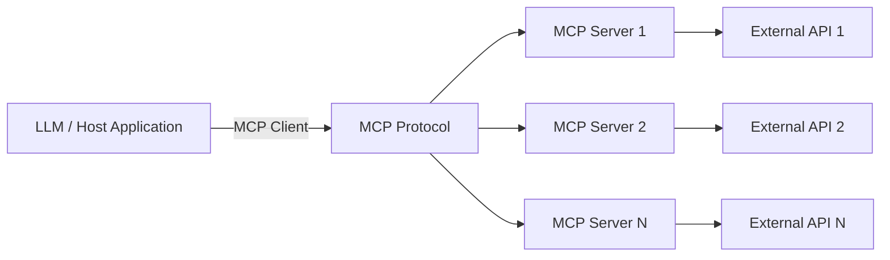

# AutoArr MCP Server Development Guide

**Version:** 1.0.0
**Last Updated:** 2025-01-08

---

## Table of Contents

1. [Introduction to MCP](#introduction-to-mcp)
2. [Why MCP for AutoArr](#why-mcp-for-autoarr)
3. [Creating a New MCP Server](#creating-a-new-mcp-server)
4. [Existing MCP Servers](#existing-mcp-servers)
5. [Best Practices](#best-practices)
6. [Testing Your MCP Server](#testing-your-mcp-server)
7. [Advanced Topics](#advanced-topics)

---

## Introduction to MCP

### What is the Model Context Protocol?

The **Model Context Protocol (MCP)** is an open standard that enables applications to provide context to Large Language Models (LLMs) in a standardized way. It defines:

- **Tools**: Actions the LLM can request to be performed
- **Resources**: Data the LLM can read
- **Prompts**: Templated interactions

### MCP Architecture



### Key Concepts

**MCP Host (Client)**

- Consumes MCP servers
- Makes tool calls
- Manages connections
- In AutoArr: The MCP Orchestrator

**MCP Server**

- Provides tools and resources
- Executes operations
- Returns structured results
- In AutoArr: SABnzbd, Sonarr, Radarr, Plex servers

**Tools**

- Named operations with parameters
- JSON schema for validation
- Return structured data

**Transport**

- How client and server communicate
- AutoArr uses `stdio` (standard input/output)
- Alternative: SSE (Server-Sent Events) for web

---

## Why MCP for AutoArr?

### Benefits of MCP

1. **Standardization**
   - Unified interface across all services
   - Consistent error handling
   - Clear contracts via JSON schemas

2. **LLM Integration**
   - LLMs can discover available tools
   - Type-safe function calling
   - Natural language to structured commands

3. **Modularity**
   - Add new services without changing core
   - Services can evolve independently
   - Easy testing and mocking

4. **Composability**
   - Chain multiple tool calls
   - Build complex workflows
   - Share context across calls

### AutoArr's MCP Architecture

```
┌─────────────────────────────────────────┐
│        AutoArr Core Application         │
│                                         │
│  ┌───────────────────────────────────┐ │
│  │      MCP Orchestrator             │ │
│  │  - Connection pooling             │ │
│  │  - Circuit breakers               │ │
│  │  - Retry logic                    │ │
│  │  - Metrics collection             │ │
│  └───────────┬───────────────────────┘ │
│              │                          │
└──────────────┼──────────────────────────┘
               │
       ┌───────┴────────┐
       │  stdio pipes   │
       └───────┬────────┘
               │
    ┌──────────┴──────────────┐
    │                         │
┌───▼────┐  ┌────▼───┐  ┌────▼────┐
│SABnzbd │  │ Sonarr │  │ Radarr  │
│  MCP   │  │  MCP   │  │   MCP   │
│Server  │  │ Server │  │  Server │
└───┬────┘  └────┬───┘  └────┬────┘
    │            │            │
┌───▼────┐  ┌────▼───┐  ┌────▼────┐
│SABnzbd │  │ Sonarr │  │ Radarr  │
│  API   │  │  API   │  │   API   │
└────────┘  └────────┘  └─────────┘
```

---

## Creating a New MCP Server

This section walks through creating a complete MCP server for a new service.

### Step 1: Create Package Structure

```bash
# Create directory structure
mkdir -p autoarr/mcp_servers/newservice
cd autoarr/mcp_servers/newservice

# Create files
touch __init__.py
touch server.py
touch client.py
touch README.md
```

**Directory Structure:**

```
autoarr/mcp_servers/newservice/
├── __init__.py          # Package initialization
├── server.py            # MCP server implementation
├── client.py            # API client for external service
└── README.md            # Server documentation
```

### Step 2: Implement API Client

The client handles communication with the external service's API.

```python
# client.py
"""
Client for NewService API.

This module provides a Python client for interacting with NewService's API.
"""

import httpx
from typing import Any, Dict, List, Optional


class NewServiceClientError(Exception):
    """Base exception for NewService client errors."""
    pass


class NewServiceClient:
    """
    Client for NewService API.

    This client provides methods to interact with NewService's REST API,
    handling authentication, error handling, and response parsing.

    Attributes:
        base_url: NewService API base URL
        api_key: API key for authentication
        timeout: Request timeout in seconds
    """

    def __init__(
        self,
        base_url: str,
        api_key: str,
        timeout: float = 30.0
    ) -> None:
        """
        Initialize NewService client.

        Args:
            base_url: NewService API URL (e.g., http://localhost:8080)
            api_key: API key for authentication
            timeout: Request timeout in seconds (default: 30.0)

        Raises:
            ValueError: If base_url or api_key is empty
        """
        if not base_url:
            raise ValueError("base_url is required")
        if not api_key:
            raise ValueError("api_key is required")

        self.base_url = base_url.rstrip("/")
        self.api_key = api_key
        self.timeout = timeout

        # Create HTTP client
        self.client = httpx.AsyncClient(
            timeout=timeout,
            headers={
                "X-Api-Key": api_key,
                "Content-Type": "application/json"
            }
        )

    async def close(self) -> None:
        """Close the HTTP client."""
        await self.client.aclose()

    async def _request(
        self,
        method: str,
        endpoint: str,
        **kwargs
    ) -> Dict[str, Any]:
        """
        Make HTTP request to NewService API.

        Args:
            method: HTTP method (GET, POST, PUT, DELETE)
            endpoint: API endpoint path
            **kwargs: Additional arguments for httpx request

        Returns:
            Parsed JSON response

        Raises:
            NewServiceClientError: If request fails
        """
        url = f"{self.base_url}{endpoint}"

        try:
            response = await self.client.request(method, url, **kwargs)
            response.raise_for_status()
            return response.json()
        except httpx.HTTPStatusError as e:
            raise NewServiceClientError(
                f"HTTP {e.response.status_code}: {e.response.text}"
            ) from e
        except httpx.RequestError as e:
            raise NewServiceClientError(
                f"Request failed: {str(e)}"
            ) from e
        except Exception as e:
            raise NewServiceClientError(
                f"Unexpected error: {str(e)}"
            ) from e

    async def get_status(self) -> Dict[str, Any]:
        """
        Get NewService status.

        Returns:
            Status information

        Raises:
            NewServiceClientError: If request fails
        """
        return await self._request("GET", "/api/status")

    async def get_items(
        self,
        limit: Optional[int] = None
    ) -> List[Dict[str, Any]]:
        """
        Get list of items.

        Args:
            limit: Maximum number of items to return

        Returns:
            List of items

        Raises:
            NewServiceClientError: If request fails
        """
        params = {}
        if limit is not None:
            params["limit"] = limit

        result = await self._request("GET", "/api/items", params=params)
        return result.get("items", [])

    async def get_config(self) -> Dict[str, Any]:
        """
        Get NewService configuration.

        Returns:
            Configuration dictionary

        Raises:
            NewServiceClientError: If request fails
        """
        return await self._request("GET", "/api/config")

    async def set_config(
        self,
        setting: str,
        value: Any
    ) -> Dict[str, Any]:
        """
        Set configuration value.

        Args:
            setting: Setting name (dot notation supported)
            value: Setting value

        Returns:
            Updated configuration

        Raises:
            NewServiceClientError: If request fails
        """
        data = {
            "setting": setting,
            "value": value
        }
        return await self._request("POST", "/api/config", json=data)
```

### Step 3: Implement MCP Server

The server exposes the client's functionality as MCP tools.

```python
# server.py
"""
NewService MCP Server.

This module implements the Model Context Protocol (MCP) server for NewService,
exposing NewService functionality as MCP tools for LLM interaction.
"""

import json
import os
import sys
from typing import Any, Dict, List

from mcp.server import Server
from mcp.server.stdio import stdio_server
from mcp.types import Tool, TextContent

from .client import NewServiceClient, NewServiceClientError


class NewServiceMCPServer:
    """
    MCP Server for NewService.

    This server exposes NewService operations as MCP tools, allowing LLMs
    to interact with NewService through the Model Context Protocol.

    Tools:
        - newservice_get_status: Get service status
        - newservice_get_items: List items
        - newservice_get_config: Get configuration
        - newservice_set_config: Set configuration value
    """

    def __init__(self, client: NewServiceClient) -> None:
        """
        Initialize NewService MCP server.

        Args:
            client: NewService client instance

        Raises:
            ValueError: If client is None
        """
        if client is None:
            raise ValueError("NewService client is required")

        self.client = client
        self.name = "newservice"
        self.version = "0.1.0"
        self._server = Server(self.name)
        self._setup_handlers()

    def _setup_handlers(self) -> None:
        """Set up MCP server handlers."""

        @self._server.list_tools()
        async def list_tools() -> List[Tool]:
            """List available tools."""
            return self._get_tools()

        @self._server.call_tool()
        async def call_tool(
            name: str,
            arguments: Dict[str, Any]
        ) -> List[TextContent]:
            """Call a tool by name with arguments."""
            return await self._call_tool(name, arguments)

    def _get_tools(self) -> List[Tool]:
        """
        Get list of available MCP tools.

        Returns:
            List of Tool objects with JSON schemas
        """
        return [
            Tool(
                name="newservice_get_status",
                description="Get NewService status and health information",
                inputSchema={
                    "type": "object",
                    "properties": {},
                    "required": []
                }
            ),
            Tool(
                name="newservice_get_items",
                description="Get list of items from NewService",
                inputSchema={
                    "type": "object",
                    "properties": {
                        "limit": {
                            "type": "integer",
                            "description": "Maximum number of items to return",
                            "minimum": 1,
                            "maximum": 100
                        }
                    },
                    "required": []
                }
            ),
            Tool(
                name="newservice_get_config",
                description="Get NewService configuration settings",
                inputSchema={
                    "type": "object",
                    "properties": {},
                    "required": []
                }
            ),
            Tool(
                name="newservice_set_config",
                description="Set a NewService configuration value",
                inputSchema={
                    "type": "object",
                    "properties": {
                        "setting": {
                            "type": "string",
                            "description": "Configuration setting name (dot notation supported)"
                        },
                        "value": {
                            "description": "New value for the setting"
                        }
                    },
                    "required": ["setting", "value"]
                }
            )
        ]

    async def _call_tool(
        self,
        name: str,
        arguments: Dict[str, Any]
    ) -> List[TextContent]:
        """
        Execute a tool call.

        Args:
            name: Tool name
            arguments: Tool arguments

        Returns:
            List of TextContent with tool results

        Raises:
            ValueError: If tool name is unknown
        """
        try:
            if name == "newservice_get_status":
                return await self._get_status()
            elif name == "newservice_get_items":
                return await self._get_items(
                    limit=arguments.get("limit")
                )
            elif name == "newservice_get_config":
                return await self._get_config()
            elif name == "newservice_set_config":
                return await self._set_config(
                    setting=arguments["setting"],
                    value=arguments["value"]
                )
            else:
                raise ValueError(f"Unknown tool: {name}")

        except NewServiceClientError as e:
            # Return error as TextContent
            return [TextContent(
                type="text",
                text=json.dumps({
                    "error": str(e),
                    "tool": name
                }, indent=2)
            )]
        except Exception as e:
            # Unexpected error
            return [TextContent(
                type="text",
                text=json.dumps({
                    "error": f"Unexpected error: {str(e)}",
                    "tool": name
                }, indent=2)
            )]

    async def _get_status(self) -> List[TextContent]:
        """Get service status."""
        result = await self.client.get_status()
        return [TextContent(
            type="text",
            text=json.dumps(result, indent=2)
        )]

    async def _get_items(
        self,
        limit: Optional[int] = None
    ) -> List[TextContent]:
        """Get items list."""
        items = await self.client.get_items(limit=limit)
        return [TextContent(
            type="text",
            text=json.dumps({
                "items": items,
                "count": len(items)
            }, indent=2)
        )]

    async def _get_config(self) -> List[TextContent]:
        """Get configuration."""
        config = await self.client.get_config()
        return [TextContent(
            type="text",
            text=json.dumps(config, indent=2)
        )]

    async def _set_config(
        self,
        setting: str,
        value: Any
    ) -> List[TextContent]:
        """Set configuration value."""
        result = await self.client.set_config(setting, value)
        return [TextContent(
            type="text",
            text=json.dumps({
                "success": True,
                "setting": setting,
                "value": value,
                "updated_config": result
            }, indent=2)
        )]

    async def run(self) -> None:
        """
        Run the MCP server using stdio transport.

        This method starts the server and handles communication via
        standard input/output streams.
        """
        async with stdio_server() as (read_stream, write_stream):
            await self._server.run(
                read_stream,
                write_stream,
                self._server.create_initialization_options()
            )


async def main():
    """
    Main entry point for NewService MCP server.

    Reads configuration from environment variables:
    - NEWSERVICE_API_URL: NewService API base URL
    - NEWSERVICE_API_KEY: NewService API key
    """
    # Get configuration from environment
    api_url = os.environ.get("NEWSERVICE_API_URL")
    api_key = os.environ.get("NEWSERVICE_API_KEY")

    if not api_url:
        print("Error: NEWSERVICE_API_URL environment variable not set", file=sys.stderr)
        sys.exit(1)

    if not api_key:
        print("Error: NEWSERVICE_API_KEY environment variable not set", file=sys.stderr)
        sys.exit(1)

    # Create client and server
    client = NewServiceClient(api_url, api_key)

    try:
        server = NewServiceMCPServer(client)
        await server.run()
    finally:
        await client.close()


if __name__ == "__main__":
    import asyncio
    asyncio.run(main())
```

### Step 4: Package Initialization

```python
# __init__.py
"""
NewService MCP server package.

This package provides an MCP server for NewService integration.
"""

from .server import NewServiceMCPServer
from .client import NewServiceClient, NewServiceClientError

__all__ = [
    "NewServiceMCPServer",
    "NewServiceClient",
    "NewServiceClientError"
]

__version__ = "0.1.0"
```

### Step 5: Documentation

````markdown
# NewService MCP Server

## Overview

This MCP server provides integration with NewService, exposing NewService functionality through the Model Context Protocol.

## Tools

### newservice_get_status

Get NewService status and health information.

**Parameters:** None

**Returns:**

```json
{
  "status": "online",
  "version": "1.0.0",
  "uptime": 3600
}
```
````

### newservice_get_items

Get list of items from NewService.

**Parameters:**

- `limit` (optional): Maximum number of items to return (1-100)

**Returns:**

```json
{
  "items": [...],
  "count": 10
}
```

### newservice_get_config

Get NewService configuration settings.

**Parameters:** None

**Returns:**

```json
{
  "setting1": "value1",
  "setting2": "value2"
}
```

### newservice_set_config

Set a configuration value.

**Parameters:**

- `setting` (required): Setting name (dot notation supported)
- `value` (required): New value

**Returns:**

```json
{
  "success": true,
  "setting": "setting1",
  "value": "new_value"
}
```

## Configuration

Set these environment variables:

- `NEWSERVICE_API_URL`: NewService API base URL (required)
- `NEWSERVICE_API_KEY`: API key for authentication (required)

## Usage

### As a standalone server

```bash
NEWSERVICE_API_URL=http://localhost:8080 \
NEWSERVICE_API_KEY=your-api-key \
python -m autoarr.mcp_servers.newservice.server
```

### From Python

```python
from autoarr.mcp_servers.newservice import NewServiceClient, NewServiceMCPServer

client = NewServiceClient("http://localhost:8080", "your-api-key")
server = NewServiceMCPServer(client)
await server.run()
```

## Testing

```bash
# Unit tests
pytest tests/unit/mcp_servers/newservice/

# Integration tests
pytest tests/integration/mcp_servers/newservice/
```

````

### Step 6: Register with Orchestrator

Update AutoArr's configuration and orchestrator to include your new server.

```python
# autoarr/api/config.py
class Settings(BaseSettings):
    # ... existing settings ...

    # NewService MCP configuration
    newservice_api_url: Optional[str] = Field(
        None,
        description="NewService API URL"
    )
    newservice_api_key: Optional[str] = Field(
        None,
        description="NewService API key"
    )
````

```python
# autoarr/api/dependencies.py
async def initialize_mcp_servers():
    """Initialize all MCP servers."""
    settings = get_settings()
    orchestrator = get_orchestrator()

    # ... existing servers ...

    # Initialize NewService if configured
    if settings.newservice_api_url and settings.newservice_api_key:
        await orchestrator.connect_server(
            "newservice",
            {
                "command": "python",
                "args": ["-m", "autoarr.mcp_servers.newservice.server"],
                "env": {
                    "NEWSERVICE_API_URL": settings.newservice_api_url,
                    "NEWSERVICE_API_KEY": settings.newservice_api_key
                }
            }
        )
```

### Step 7: Add Environment Variables

```bash
# .env.example
# Add these lines:

# NewService Configuration
NEWSERVICE_API_URL=http://localhost:8080
NEWSERVICE_API_KEY=your-api-key-here
```

---

## Existing MCP Servers

AutoArr includes MCP servers for the following services.

### SABnzbd MCP Server

**Location:** `/app/autoarr/mcp_servers/sabnzbd/`

**Tools:**

- `sabnzbd_get_queue` - Get download queue
- `sabnzbd_get_history` - Get download history
- `sabnzbd_retry_download` - Retry failed download
- `sabnzbd_get_config` - Get configuration
- `sabnzbd_set_config` - Set configuration value
- `sabnzbd_pause_queue` - Pause downloads
- `sabnzbd_resume_queue` - Resume downloads
- `sabnzbd_delete_download` - Delete download

**Environment Variables:**

- `SABNZBD_API_URL` - SABnzbd API URL
- `SABNZBD_API_KEY` - SABnzbd API key

### Sonarr MCP Server

**Location:** `/app/autoarr/mcp_servers/sonarr/`

**Tools:**

- `sonarr_get_series` - List all TV shows
- `sonarr_get_series_by_id` - Get specific show
- `sonarr_add_series` - Add new show
- `sonarr_delete_series` - Delete show
- `sonarr_get_episodes` - List episodes
- `sonarr_search_series` - Trigger episode search
- `sonarr_get_config` - Get configuration
- `sonarr_set_config` - Set configuration value

**Environment Variables:**

- `SONARR_API_URL` - Sonarr API URL
- `SONARR_API_KEY` - Sonarr API key

### Radarr MCP Server

**Location:** `/app/autoarr/mcp_servers/radarr/`

**Tools:**

- `radarr_get_movies` - List all movies
- `radarr_get_movie_by_id` - Get specific movie
- `radarr_add_movie` - Add new movie
- `radarr_delete_movie` - Delete movie
- `radarr_search_movie` - Trigger movie search
- `radarr_get_config` - Get configuration
- `radarr_set_config` - Set configuration value

**Environment Variables:**

- `RADARR_API_URL` - Radarr API URL
- `RADARR_API_KEY` - Radarr API key

### Plex MCP Server

**Location:** `/app/autoarr/mcp_servers/plex/`

**Tools:**

- `plex_get_libraries` - List libraries
- `plex_get_recently_added` - Get recently added media
- `plex_scan_library` - Trigger library scan
- `plex_get_server_info` - Get server information

**Environment Variables:**

- `PLEX_URL` - Plex server URL
- `PLEX_TOKEN` - Plex authentication token

---

## Best Practices

### Error Handling

**Always handle errors gracefully:**

```python
async def _call_tool(self, name: str, arguments: Dict[str, Any]) -> List[TextContent]:
    """Execute tool with comprehensive error handling."""
    try:
        # Tool execution logic
        result = await self._execute_tool(name, arguments)
        return [TextContent(type="text", text=json.dumps(result, indent=2))]

    except ClientError as e:
        # Client/API errors
        return [TextContent(
            type="text",
            text=json.dumps({
                "error": "client_error",
                "message": str(e),
                "tool": name
            }, indent=2)
        )]

    except ValueError as e:
        # Validation errors
        return [TextContent(
            type="text",
            text=json.dumps({
                "error": "validation_error",
                "message": str(e),
                "tool": name
            }, indent=2)
        )]

    except Exception as e:
        # Unexpected errors
        return [TextContent(
            type="text",
            text=json.dumps({
                "error": "internal_error",
                "message": f"Unexpected error: {str(e)}",
                "tool": name
            }, indent=2)
        )]
```

### JSON Schema Validation

**Use comprehensive JSON schemas:**

```python
Tool(
    name="example_tool",
    description="Clear, concise description of what the tool does",
    inputSchema={
        "type": "object",
        "properties": {
            "required_param": {
                "type": "string",
                "description": "What this parameter does",
                "minLength": 1,
                "maxLength": 100
            },
            "optional_param": {
                "type": "integer",
                "description": "What this parameter does",
                "minimum": 1,
                "maximum": 1000,
                "default": 50
            },
            "enum_param": {
                "type": "string",
                "description": "What this parameter does",
                "enum": ["option1", "option2", "option3"]
            }
        },
        "required": ["required_param"]
    }
)
```

### Logging

**Add structured logging:**

```python
import logging

logger = logging.getLogger(__name__)

class NewServiceMCPServer:
    async def _call_tool(self, name: str, arguments: Dict[str, Any]) -> List[TextContent]:
        logger.info(
            "Tool called",
            extra={
                "tool": name,
                "arguments": arguments
            }
        )

        try:
            result = await self._execute_tool(name, arguments)

            logger.info(
                "Tool completed successfully",
                extra={
                    "tool": name,
                    "result_size": len(str(result))
                }
            )

            return result

        except Exception as e:
            logger.error(
                "Tool failed",
                extra={
                    "tool": name,
                    "error": str(e)
                },
                exc_info=True
            )
            raise
```

### Type Hints

**Use comprehensive type hints:**

```python
from typing import Any, Dict, List, Optional, Union

async def set_config(
    self,
    setting: str,
    value: Union[str, int, float, bool]
) -> Dict[str, Any]:
    """
    Set configuration value.

    Args:
        setting: Setting name
        value: New value (string, int, float, or bool)

    Returns:
        Updated configuration dictionary

    Raises:
        ValueError: If setting name is invalid
        ClientError: If API request fails
    """
    pass
```

### Async/Await

**Use async consistently:**

```python
# Good - Async all the way
async def get_items(self) -> List[Dict[str, Any]]:
    result = await self.client.get("/api/items")
    return result["items"]

async def _call_tool(self, name: str, arguments: Dict[str, Any]):
    if name == "get_items":
        items = await self.get_items()  # Await async function
        return [TextContent(type="text", text=json.dumps(items))]

# Bad - Mixing sync and async
def get_items(self) -> List[Dict[str, Any]]:  # Not async
    # This won't work in async context
    result = requests.get(f"{self.base_url}/api/items")
    return result.json()["items"]
```

### Resource Cleanup

**Always clean up resources:**

```python
class NewServiceClient:
    async def __aenter__(self):
        """Async context manager entry."""
        return self

    async def __aexit__(self, exc_type, exc_val, exc_tb):
        """Async context manager exit."""
        await self.close()

    async def close(self):
        """Close HTTP client."""
        if hasattr(self, 'client'):
            await self.client.aclose()

# Usage
async with NewServiceClient(url, key) as client:
    result = await client.get_status()
    # Client automatically closed
```

---

## Testing Your MCP Server

### Unit Tests

Test individual components in isolation.

```python
# tests/unit/mcp_servers/newservice/test_client.py
import pytest
from httpx import AsyncClient, Response
from autoarr.mcp_servers.newservice import NewServiceClient, NewServiceClientError


@pytest.fixture
def client():
    """Create test client."""
    return NewServiceClient(
        base_url="http://test.example.com",
        api_key="test-key"
    )


@pytest.mark.asyncio
async def test_get_status_success(client, respx_mock):
    """Test successful status retrieval."""
    # Mock HTTP response
    respx_mock.get("http://test.example.com/api/status").mock(
        return_value=Response(200, json={"status": "ok"})
    )

    result = await client.get_status()

    assert result["status"] == "ok"


@pytest.mark.asyncio
async def test_get_status_error(client, respx_mock):
    """Test status retrieval error handling."""
    # Mock HTTP error
    respx_mock.get("http://test.example.com/api/status").mock(
        return_value=Response(500, text="Internal Error")
    )

    with pytest.raises(NewServiceClientError):
        await client.get_status()


@pytest.mark.asyncio
async def test_set_config(client, respx_mock):
    """Test configuration setting."""
    respx_mock.post("http://test.example.com/api/config").mock(
        return_value=Response(200, json={"setting1": "new_value"})
    )

    result = await client.set_config("setting1", "new_value")

    assert result["setting1"] == "new_value"
```

```python
# tests/unit/mcp_servers/newservice/test_server.py
import pytest
from mcp.types import TextContent
from autoarr.mcp_servers.newservice import NewServiceMCPServer, NewServiceClient


@pytest.fixture
def mock_client(mocker):
    """Create mock client."""
    client = mocker.Mock(spec=NewServiceClient)
    return client


@pytest.fixture
def server(mock_client):
    """Create server with mock client."""
    return NewServiceMCPServer(mock_client)


@pytest.mark.asyncio
async def test_get_tools(server):
    """Test tools list."""
    tools = server._get_tools()

    assert len(tools) > 0
    assert any(t.name == "newservice_get_status" for t in tools)


@pytest.mark.asyncio
async def test_call_tool_get_status(server, mock_client):
    """Test get_status tool call."""
    # Mock client response
    mock_client.get_status.return_value = {"status": "ok"}

    result = await server._call_tool("newservice_get_status", {})

    assert len(result) == 1
    assert isinstance(result[0], TextContent)
    assert "ok" in result[0].text
    mock_client.get_status.assert_called_once()


@pytest.mark.asyncio
async def test_call_tool_unknown(server):
    """Test unknown tool call."""
    with pytest.raises(ValueError, match="Unknown tool"):
        await server._call_tool("unknown_tool", {})
```

### Integration Tests

Test server with real API (or mock server).

```python
# tests/integration/mcp_servers/newservice/test_integration.py
import pytest
import os
from autoarr.mcp_servers.newservice import NewServiceClient, NewServiceMCPServer


@pytest.mark.integration
@pytest.mark.asyncio
async def test_full_workflow():
    """Test complete workflow with real API."""
    # Requires NewService running locally
    api_url = os.environ.get("NEWSERVICE_API_URL", "http://localhost:8080")
    api_key = os.environ.get("NEWSERVICE_API_KEY", "test-key")

    client = NewServiceClient(api_url, api_key)

    try:
        # Test status
        status = await client.get_status()
        assert "status" in status

        # Test items
        items = await client.get_items(limit=10)
        assert isinstance(items, list)
        assert len(items) <= 10

        # Test config
        config = await client.get_config()
        assert isinstance(config, dict)

    finally:
        await client.close()


@pytest.mark.integration
@pytest.mark.asyncio
async def test_mcp_server_tools():
    """Test MCP server with real client."""
    api_url = os.environ.get("NEWSERVICE_API_URL", "http://localhost:8080")
    api_key = os.environ.get("NEWSERVICE_API_KEY", "test-key")

    client = NewServiceClient(api_url, api_key)
    server = NewServiceMCPServer(client)

    try:
        # Test get_status tool
        result = await server._call_tool("newservice_get_status", {})
        assert len(result) == 1
        assert "status" in result[0].text

        # Test get_items tool
        result = await server._call_tool("newservice_get_items", {"limit": 5})
        assert len(result) == 1
        assert "items" in result[0].text

    finally:
        await client.close()
```

### Running Tests

```bash
# Unit tests only
pytest tests/unit/mcp_servers/newservice/ -v

# Integration tests (requires service running)
pytest tests/integration/mcp_servers/newservice/ -v --run-integration

# All tests with coverage
pytest tests/unit/mcp_servers/newservice/ tests/integration/mcp_servers/newservice/ \
  --cov=autoarr.mcp_servers.newservice \
  --cov-report=html \
  --cov-report=term

# Test specific functionality
pytest tests/unit/mcp_servers/newservice/test_client.py::test_get_status_success -v
```

---

## Advanced Topics

### Caching

Implement caching for expensive operations:

```python
from functools import lru_cache
from datetime import datetime, timedelta

class NewServiceClient:
    def __init__(self, base_url: str, api_key: str):
        self.base_url = base_url
        self.api_key = api_key
        self._cache: Dict[str, tuple[Any, datetime]] = {}
        self._cache_ttl = timedelta(minutes=5)

    async def get_config(self, use_cache: bool = True) -> Dict[str, Any]:
        """Get configuration with caching."""
        cache_key = "config"

        # Check cache
        if use_cache and cache_key in self._cache:
            data, cached_at = self._cache[cache_key]
            if datetime.now() - cached_at < self._cache_ttl:
                return data

        # Fetch from API
        result = await self._request("GET", "/api/config")

        # Update cache
        self._cache[cache_key] = (result, datetime.now())

        return result

    def clear_cache(self):
        """Clear all cached data."""
        self._cache.clear()
```

### Rate Limiting

Implement rate limiting to avoid API throttling:

```python
import asyncio
from datetime import datetime

class RateLimiter:
    """Token bucket rate limiter."""

    def __init__(self, rate: float, burst: int):
        self.rate = rate  # Requests per second
        self.burst = burst  # Max burst size
        self.tokens = burst
        self.updated_at = datetime.now()
        self.lock = asyncio.Lock()

    async def acquire(self):
        """Acquire permission to make request."""
        async with self.lock:
            now = datetime.now()
            elapsed = (now - self.updated_at).total_seconds()

            # Refill tokens
            self.tokens = min(
                self.burst,
                self.tokens + elapsed * self.rate
            )
            self.updated_at = now

            # Wait if no tokens available
            if self.tokens < 1:
                wait_time = (1 - self.tokens) / self.rate
                await asyncio.sleep(wait_time)
                self.tokens = 0
            else:
                self.tokens -= 1

class NewServiceClient:
    def __init__(self, base_url: str, api_key: str):
        self.base_url = base_url
        self.api_key = api_key
        # 10 requests per second, burst of 20
        self.rate_limiter = RateLimiter(rate=10.0, burst=20)

    async def _request(self, method: str, endpoint: str, **kwargs):
        """Make rate-limited request."""
        await self.rate_limiter.acquire()
        # ... make request ...
```

### Retry Logic

Implement exponential backoff for failed requests:

```python
import asyncio
from typing import TypeVar, Callable

T = TypeVar('T')

async def retry_with_backoff(
    func: Callable[[], T],
    max_retries: int = 3,
    base_delay: float = 1.0,
    max_delay: float = 60.0
) -> T:
    """
    Retry function with exponential backoff.

    Args:
        func: Async function to retry
        max_retries: Maximum retry attempts
        base_delay: Initial delay in seconds
        max_delay: Maximum delay in seconds

    Returns:
        Function result

    Raises:
        Last exception if all retries fail
    """
    for attempt in range(max_retries + 1):
        try:
            return await func()
        except Exception as e:
            if attempt == max_retries:
                raise

            # Calculate delay with exponential backoff
            delay = min(base_delay * (2 ** attempt), max_delay)

            logger.warning(
                f"Attempt {attempt + 1} failed, retrying in {delay}s",
                error=str(e)
            )

            await asyncio.sleep(delay)

class NewServiceClient:
    async def get_status(self) -> Dict[str, Any]:
        """Get status with automatic retries."""
        return await retry_with_backoff(
            lambda: self._request("GET", "/api/status"),
            max_retries=3
        )
```

### Health Checks

Implement health checking:

```python
class NewServiceClient:
    async def health_check(self) -> bool:
        """
        Check if service is healthy.

        Returns:
            True if healthy, False otherwise
        """
        try:
            status = await self.get_status()
            return status.get("status") == "ok"
        except Exception as e:
            logger.error(f"Health check failed: {e}")
            return False

    async def wait_for_healthy(
        self,
        timeout: float = 30.0,
        interval: float = 1.0
    ) -> bool:
        """
        Wait for service to become healthy.

        Args:
            timeout: Maximum wait time in seconds
            interval: Check interval in seconds

        Returns:
            True if service became healthy, False if timeout
        """
        start = datetime.now()

        while (datetime.now() - start).total_seconds() < timeout:
            if await self.health_check():
                return True
            await asyncio.sleep(interval)

        return False
```

---

## Summary

Creating an MCP server for AutoArr involves:

1. **API Client**: Async HTTP client for external service
2. **MCP Server**: Exposes client functionality as tools
3. **Registration**: Integrate with AutoArr's orchestrator
4. **Testing**: Comprehensive unit and integration tests
5. **Documentation**: Clear docs for users and developers

Following these patterns ensures consistency, maintainability, and reliability across all AutoArr MCP servers.

For questions or contributions, see [CONTRIBUTING.md](/app/docs/CONTRIBUTING.md).
